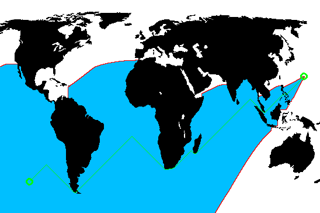

# Planners

Visualize popular planners on World Map.

Dijkstra visualized:


Astar visualized:



# Build 

requires [opencv](https://docs.opencv.org/master/df/d65/tutorial_table_of_content_introduction.html)

```bash
# git clone
git clone https://github.com/yh675/Planners.git
cd Planners
# build
cmake .
make 
```

# Run

```bash
#Input planner type, options are: dij, astar
./Planners dij
```
